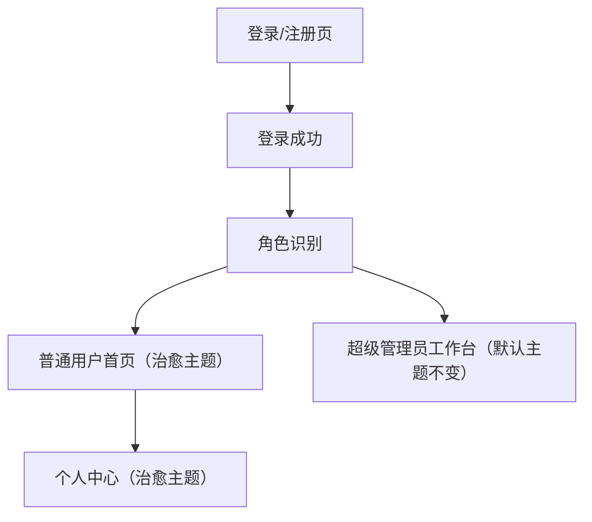

## 1. Product Overview
为“普通用户”提供温馨治愈风格的前端视觉与交互体验，同时保持“超级管理员”界面视觉与布局不变。
改造聚焦于主题样式、组件外观与页面信息层级，不新增业务功能。

## 2. Core Features

### 2.1 User Roles
| 角色 | 进入方式 | 核心权限 |
|------|----------|----------|
| 普通用户 | 使用现有登录入口登录 | 仅访问普通用户可见菜单与页面；启用“温馨治愈主题” |
| 超级管理员 | 使用现有登录入口登录 | 访问全量管理菜单与页面；保持现有主题与样式不变 |

### 2.2 Feature Module
本次改造涉及以下最小页面集（仅做 UI/样式调整）：
1. **登录/注册页**：治愈风背景与表单卡片样式、按钮与输入框统一风格、提示信息更友好。
2. **普通用户首页（工作台/仪表盘）**：信息卡片治愈风视觉、模块间距与层级优化、常用入口与列表的卡片化呈现。
3. **个人中心**：头像/资料卡片治愈风样式、表单与分组标题层级、操作按钮与成功/失败提示样式。

### 2.3 Page Details
| Page Name | Module Name | Feature description |
|---|---|---|
| 登录/注册页 | 角色识别与主题启用 | 登录成功后根据角色自动加载主题：普通用户启用“治愈主题”，超级管理员保持默认主题 |
| 登录/注册页 | 视觉与文案统一 | 优化背景图、品牌区、表单卡片、按钮/输入框状态（默认/hover/focus/disabled），校验提示更温和清晰 |
| 普通用户首页（工作台/仪表盘） | 信息层级与卡片体系 | 统一卡片圆角/阴影/间距；强化标题-副标题-数据层级；列表/统计模块保持原功能但更易读 |
| 普通用户首页（工作台/仪表盘） | 导航与密度优化 | 侧边栏/顶部栏在普通用户下降低信息密度（更大留白、更柔和对比度），不改变菜单结构与权限逻辑 |
| 个人中心 | 资料展示与编辑外观 | 资料区卡片化分组；表单控件外观统一；主次按钮与危险操作样式清晰可辨 |
| 全局（普通用户范围） | 设计令牌与组件皮肤 | 建立“治愈主题”设计令牌（颜色/字体/圆角/阴影/间距）；覆盖 Element-UI 常用组件（Button/Input/Form/Dialog/Table/Tag/Message）外观 |
| 全局（超级管理员范围） | 不变更约束 | 超级管理员登录后使用现有默认主题，不应用任何治愈主题覆盖样式 |

## 3. Core Process
- 普通用户流程：访问登录页 → 登录成功 → 系统识别为普通用户 → 自动启用治愈主题 → 进入普通用户首页 → 可进入个人中心查看/编辑资料。
- 超级管理员流程：访问登录页 → 登录成功 → 系统识别为超级管理员 → 保持现有默认主题 → 进入现有管理工作台与各管理页面。

