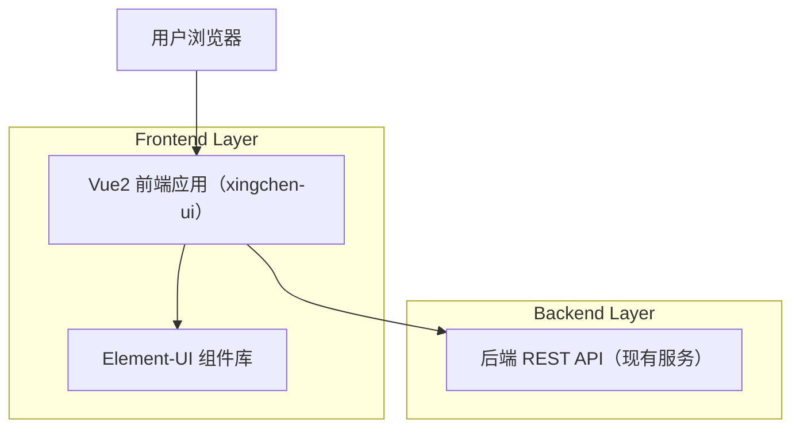

## 1.Architecture design

## 2.Technology Description
- Frontend: Vue@2.6 + vue-router@3 + vuex@3 + element-ui@2.15 + sass
- Backend: 现有后端服务（本次仅涉及 UI 主题与样式，不新增接口）

## 3.Route definitions
| Route | Purpose |
|---|---|
| /login | 登录页（普通用户治愈风；管理员保持原样式或不受影响） |
| /register | 注册页（普通用户治愈风；管理员保持原样式或不受影响） |
| /index | 首页/工作台（普通用户治愈风；管理员默认主题） |
| /user/profile | 个人中心（普通用户治愈风；管理员默认主题） |

## 4.API definitions (If it includes backend services)
无（本需求为前端主题/样式改造，不引入新后端服务与新 API）。

## 6.Data model(if applicable)
无（本需求不新增数据实体）。

### 主题隔离实现要点（约束说明）
- 以“角色”为主题开关：登录后从现有用户信息/权限中识别是否为普通用户；仅普通用户挂载 `theme-heal`（例如在 `body` 或根容器上增加类名）。
- 以“设计令牌”为覆盖方式：通过 CSS Variables + SCSS 变量对 Element-UI 常用组件做皮肤覆盖；默认主题不改动，避免影响超级管理员。
- 以“选择器作用域”保证不串色：所有治愈主题覆盖样式限定在 `.theme-heal` 作用域内。